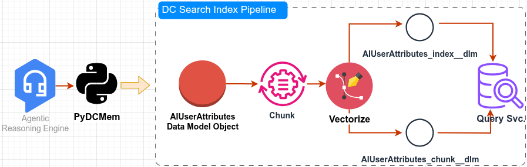

# PyDCMem

**Enterprise Agentic Memory implementation based on [Salesforce Data Cloud](https://www.salesforce.com/data/)**

Possible Audience: Salesforce Enterprise Customers & Partners, Software Architects, Salesforce Admins. 

Majority of Salesforce Enterprise customers have already invested extensively in customized Data Cloud implementation in their own Salesforce eco-system (one or multiple orgs). How do we provide an Agentic Memory Solution for [Salesforce Agentforce](https://www.salesforce.com/agentforce/) that simply plugs into these custom DC implementation without any specific modifications?   

PyDCMem is a Python library that provides intelligent memory management for Enterprise Agentic systems by extracting, storing, and retrieving user-specific attributes and preferences from conversations using Salesforce Data Cloud as the backend storage and data processing engine. 

The setup requires only creating standard Search Index and Streaming Ingestion pipelines without any custom handling, and we have a fully compliant Agentic Memory solution with PyDCMem.
## Features

- **Intelligent Memory Extraction and Updates**: Uses OpenAI LLMs (WIP to extend to other LLMs) to extract memory-worthy facts from user utterances, conversations, previous memories, session variables. Further updates semantically similar memories in DC with newer facts.
- **Data Cloud Integration**: Seamlessly stores and retrieves user attributes using Salesforce Data Cloud
- **Vector Search**: Leverages vector search capabilities for relevant memory retrieval
- **Flexible Context Support**: Handles session variables, dialogue history, and past memory facts
- **Robust Error Handling**: Comprehensive error handling and retry mechanisms
- **CLI Interface**: Command-line interface for testing and integration

## Installation

### Option 1: Install from GitHub (Recommended)

```bash
pip install git+https://github.com/mbhonsle/pydcmem.git
```

### Option 2: Clone and Install Locally

```bash
# Clone the repository
git clone https://github.com/mbhonsle/pydcmem.git
cd pydcmem

# Install in development mode
pip install -e .

# Or install normally
pip install .
```

### Option 3: Install from Local Source

If you have the source code locally:

```bash
# Navigate to the project directory
cd /path/to/pydcmem

# Install in development mode (recommended for development)
pip install -e .

# Or install normally
pip install .
```

### Development Installation

For development work, install with the `-e` flag to enable editable installs:

```bash
git clone https://github.com/mbhonsle/pydcmem.git
cd pydcmem
pip install -e .
```

This allows you to make changes to the source code without reinstalling the package.

## Quick Start

### Basic Usage

```python
from pydc_mem import MemoryExtractor, UserAttributeClient, AgentMemoryOrchestrator

# Initialize components
extractor = MemoryExtractor()  # Reads OPENAI_API_KEY from environment
ua_client = UserAttributeClient()  # Reads Data Cloud credentials from environment
orchestrator = AgentMemoryOrchestrator(extractor, ua_client)

# Extract and store memories
candidates, report = orchestrator.update(
    user_id="user-123",
    utterance="I usually fly Delta and prefer window seats.",
    session_vars={"passengers": 2, "class": "economy"},
    recent_dialogue=[("Agent", "Do you want Delta again?"), ("User", "Yes, Delta")],
    past_memory_facts=["Home airport = SFO"]
)

print(f"Added: {report.added}, Updated: {report.updated}, Skipped: {report.skipped}")
```

### Command Line Interface

```bash
# Set required environment variables
export OPENAI_API_KEY="sk-..."
export MEMORY_DLO="your_dlo"
export MEMORY_CONNECTOR="your_connector"
export VECTOR_IDX_DLM="your_vector_index"
export CHUNK_DLM="your_chunk_dlm"
export SALESFORCE_ORGANIZATION_ID="your_org_id"

# Extract and store memories
python -m pydc_mem.dcmem --user-id "user-123" --utterance "I prefer morning flights" --op-type update

# Retrieve relevant memories
python -m pydc_mem.dcmem --user-id "user-123" --utterance "What are my preferences?" --op-type get
```

## Architecture


The architecture leverages two fundamental Salesforce Data Cloud processes:
 - Streaming Ingestion
 - Search Index Pipeline

The following documentation walks you through the required Data Cloud in detail:


## Configuration

### Environment Variables

| Variable | Description | Required |
|----------|-------------|----------|
| `OPENAI_API_KEY` | OpenAI API key for LLM access | Yes |
| `MEMORY_DLO` | Data Cloud DLO (Data Lake Object) name | Yes |
| `MEMORY_CONNECTOR` | Data Cloud connector API name | Yes |
| `VECTOR_IDX_DLM` | Vector index DLM for search | Yes |
| `CHUNK_DLM` | Chunk DLM for vector search | Yes |
| `SALESFORCE_ORGANIZATION_ID` | Salesforce organization ID | Yes |

### Data Schema

The library uses the `AIUserAttributes` schema defined in `AIUserAttributesSchema.yml`:

```yaml
AIUserAttributes:
  properties:
    tenantId: string
    userId: string
    attribute: string
    value: string
    confidence: number
    source: string
    updatedBy: string
    createdAt: string (date-time)
    lastModifiedAt: string (date-time)
    metadata: string
    id: string
```

## Advanced Usage

### Custom Memory Extraction

```python
# Custom system prompt for specific use cases
custom_extractor = MemoryExtractor(
    system_instructions="""You are a travel assistant that extracts travel preferences.
    Focus on: airlines, hotels, seating preferences, meal preferences, and travel times.""",
    model="gpt-4o",
    temperature=0.1
)
```

### Error Handling

```python
try:
    candidates, report = orchestrator.update(
        user_id="user-123",
        utterance="I prefer Delta Airlines"
    )
    
    if report.errors > 0:
        print(f"Errors occurred: {report.errors}")
        for detail in report.details:
            if detail.error:
                print(f"Error in {detail.attribute}: {detail.error}")
                
except Exception as e:
    print(f"Processing failed: {e}")
```

## Testing

### Running Tests

The project includes comprehensive unit tests and integration tests.

#### Quick Start

```bash
# Install development dependencies
pip install -e ".[dev]"

# Run all unit tests
pytest

# Run with coverage
pytest --cov=src/pydc_mem --cov-report=html

# Run integration tests (requires API keys)
pytest -m integration
```

#### Using the Test Runner

```bash
# Run unit tests only
python run_tests.py

# Run integration tests (requires API keys)
python run_tests.py integration

# Run all tests with coverage
python run_tests.py all

# Install dev dependencies and run tests
python run_tests.py --install-dev
```

#### Using Make

```bash
# Install development dependencies
make install-dev

# Run unit tests
make test-unit

# Run integration tests
make test-integration

# Run tests with coverage
make test-cov

# Run linting
make lint

# Format code
make format

# Run CI checks
make ci
```

### Test Structure

```
tests/
├── __init__.py
├── conftest.py                    # Test configuration and fixtures
├── test_memory_extractor.py       # MemoryExtractor tests
├── test_memory_client.py          # UserAttributeClient tests
├── test_orchestrator.py           # AgentMemoryOrchestrator tests
└── test_utilities.py              # Utility classes tests
```

### Test Categories

- **Unit Tests**: Test individual components in isolation with mocked dependencies

## Development

### Project Structure

```
src/
├── pydc_mem/
│   ├── __init__.py
│   ├── dcmem.py                    # Main orchestrator and CLI
│   ├── core/
│   │   ├── memory_client.py        # Data Cloud client
│   │   └── memory_extractor.py     # LLM-based extraction
│   └── util/
│       ├── ingestion_client.py     # Data Cloud ingestion
│       ├── query_svc.py           # Query service client
│       └── memory_results_parser.py # Result parsing
└── AIUserAttributesSchema.yml      # Data schema definition
```

### Dependencies

- **httpx**: HTTP client for API communication
- **openai**: OpenAI API client for LLM access
- **pydantic**: Data validation and serialization
- **pydc-auth**: Salesforce authentication
- **python-dotenv**: Environment variable management
- **tenacity**: Retry mechanisms
- **cryptography**: Security utilities
- **PyJWT**: JWT token handling
- **uuid6**: UUID generation

## Contributing

1. Fork the repository
2. Create a feature branch
3. Make your changes
4. Add tests if applicable
5. Submit a pull request

## License

This project is licensed under the MIT License - see the [LICENSE](LICENSE) file for details.

## Support

For issues and questions:
- GitHub Issues: [https://github.com/mbhonsle/pydcmem/issues](https://github.com/mbhonsle/pydcmem/issues)
- Documentation: [https://github.com/mbhonsle/pydcmem](https://github.com/mbhonsle/pydcmem)

## Changelog

### v0.1.0
- Initial release
- Core memory extraction and storage functionality
- Data Cloud integration
- CLI interface
- Vector search support
